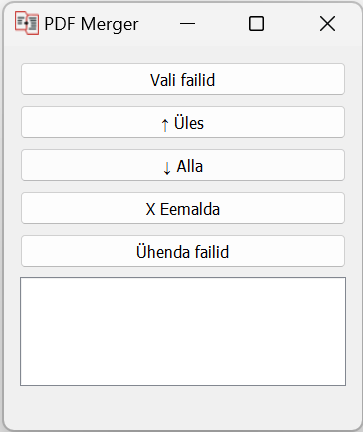

# PDF Ühendaja


## Sisukord
1. [Projekti ülevaade](#projekti-ülevaade)
2. [Kasutusjuhend](#kasutusjuhend)
3. [Paigaldamine](#paigaldamine)
4. [Autorid ja tugi](#autorid-ja-tugi)

## Projekti ülevaade

PDF Ühendaja on kasutajasõbralik tööriist, mille abil saab ühendada mitu PDF-faili üheks. See on loodud Pythoni ja PyQt5 abil ning on varustatud graafilise kasutajaliidesega, mis muudab selle kasutamise lihtsaks ja intuitiivseks.

Peamised omadused:
* Valige mitu PDF-faili, mida soovite ühendada
* Muutke PDF-failide järjekorda
* Eemaldage valitud PDF-failid
* Ühendage valitud PDF-failid üheks failiks

## Kasutusjuhend

1. **Vali failid** - Vajutage "Vali failid" nuppu ja valige failid, mida soovite ühendada.

2. **Failide järjekorra muutmine** - Kui soovite muuta failide järjekorda, millest ühendatud PDF koosneb, valige fail ja vajutage nuppe "↑ Üles" või "↓ Alla" faili liigutamiseks.

3. **Failide eemaldamine** - Kui soovite eemaldada mõne valitud faili, valige fail ja vajutage "X Eemalda" nuppu.

4. **Failide ühendamine** - Kui olete valmis failid ühendama, vajutage "Ühenda failid" nuppu. Teile kuvatakse dialoog, kus saate määrata ühendatud faili nime ja salvestuskoha.

## Paigaldamine

Selle tööriista kasutamiseks peate olema installinud Pythoni ja PyQt5. Need saab installida järgmiselt:

Pythoni paigaldamine:
```bash
# Windows
https://www.python.org/downloads/
või
https://www.python.org/downloads/release/python-31011/

# Ubuntu
sudo apt-get update
sudo apt-get install python3.10
```

PyQt5 installimine:
```bash
pip install pyqt5
```

PDF Ühendaja kasutamiseks kloonige see repositoorium ja käivitage `main.py`.

```bash
git clone https://github.com/yourusername/pdf-merger.git
cd pdf-merger
python main.py
```

## Autorid ja tugi

See projekt on loodud Ken Böckler poolt. Kui teil on küsimusi või soovite teatada veast, palun avage probleem Githubi repositooriumis.

---